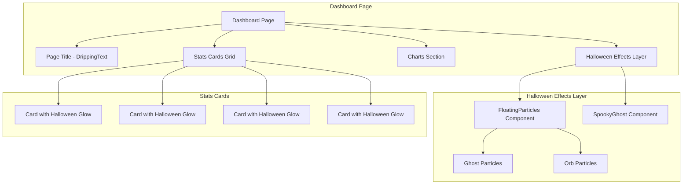

# Design Document: Halloween Dashboard Theme

## Overview

This design enhances the dashboard overview page with Halloween-themed visual elements including floating ghost particles, interactive ghost components, dripping text effects, and subtle card styling. The implementation prioritizes performance through CSS animations, proper cleanup, and responsive scaling for mobile devices.

## Architecture



## Components and Interfaces

### 1. FloatingParticles Component

A new component that renders animated floating particles across the dashboard.

```typescript
// components/floating-particles.tsx
interface FloatingParticlesProps {
  className?: string;
  particleCount?: number;        // Default: 15 desktop, 8 mobile
  colors?: string[];             // Halloween colors
}

interface Particle {
  id: number;
  x: number;                     // Initial X position (%)
  y: number;                     // Initial Y position (%)
  size: number;                  // Particle size (px)
  duration: number;              // Animation duration (s)
  delay: number;                 // Animation delay (s)
  color: string;                 // Particle color
  type: 'ghost' | 'orb';         // Particle type
}

export function FloatingParticles({ 
  className, 
  particleCount, 
  colors 
}: FloatingParticlesProps): JSX.Element
```

### 2. HalloweenStatsCard Component

Enhanced stats card with Halloween styling.

```typescript
// Updated StatsCard in dashboard/page.tsx
interface StatsCardProps {
  title: string;
  value: string;
  description: string;
  icon: React.ReactNode;
  progress?: number;
  halloweenGlow?: boolean;       // Enable Halloween glow effect
}
```

### 3. Updated Dashboard Page Structure

```typescript
// app/(protected)/dashboard/page.tsx
<>
  {/* Halloween Effects Layer - positioned fixed behind content */}
  <FloatingParticles className="fixed inset-0 pointer-events-none z-0" />
  
  {/* SpookyGhost - positioned in corner */}
  <SpookyGhost className="fixed bottom-4 right-4 w-20 h-20 z-10" />
  
  <div className="relative z-10">
    {/* Page Title with DrippingText */}
    <PageTitle>
      <DrippingText text="Dashboard" color="#fb923c" />
    </PageTitle>
    
    {/* Stats Cards with Halloween glow */}
    <div className="grid gap-4 sm:grid-cols-2 lg:grid-cols-4">
      {statsCards.map((card) => (
        <StatsCard key={card.title} {...card} halloweenGlow />
      ))}
    </div>
    
    {/* Charts */}
    <div className="grid gap-4 lg:grid-cols-2">
      <StudySessionDistribution />
      <StudyDurationChart />
    </div>
  </div>
</>
```

## Data Models

### Particle Configuration

```typescript
const HALLOWEEN_COLORS = [
  '#fb923c',  // Orange
  '#a855f7',  // Purple
  '#f8fafc',  // Ghostly white
  '#fbbf24',  // Amber
  '#c084fc',  // Light purple
];

const PARTICLE_CONFIG = {
  desktop: {
    count: 15,
    maxCount: 20,
  },
  mobile: {
    count: 8,
    maxCount: 10,
  },
};
```

### Component State

```typescript
interface FloatingParticlesState {
  particles: Particle[];
  isMobile: boolean;
  mounted: boolean;
}
```

## Correctness Properties

*A property is a characteristic or behavior that should hold true across all valid executions of a system-essentially, a formal statement about what the system should do. Properties serve as the bridge between human-readable specifications and machine-verifiable correctness guarantees.*

Based on the prework analysis, the following properties are testable:

### Property 1: Particle Count Limit
*For any* particle system render, the number of particles SHALL be less than or equal to 20 to maintain performance.
**Validates: Requirements 4.4**

### Property 2: Particle Color Validity
*For any* rendered particle, its color SHALL be one of the allowed Halloween colors (orange, purple, ghostly white, amber, light purple).
**Validates: Requirements 2.3**

### Property 3: Particle Non-Interference
*For any* rendered particle element, the element SHALL have pointer-events set to none to prevent blocking user interactions.
**Validates: Requirements 2.4**

### Property 4: Mobile Particle Reduction
*For any* mobile viewport (width < 1024px), the particle count SHALL be less than the desktop particle count.
**Validates: Requirements 5.1**

### Property 5: Resource Cleanup on Unmount
*For any* FloatingParticles component unmount, all animation frames and intervals SHALL be cancelled to prevent memory leaks.
**Validates: Requirements 4.3**

## Error Handling

### Component Mount Safety

```typescript
const [mounted, setMounted] = useState(false);

useEffect(() => {
  setMounted(true);
  return () => setMounted(false);
}, []);

if (!mounted) return null;
```

### Animation Cleanup

```typescript
useEffect(() => {
  const animationId = requestAnimationFrame(animate);
  
  return () => {
    cancelAnimationFrame(animationId);
  };
}, []);
```

### Responsive Detection

```typescript
const [isMobile, setIsMobile] = useState(false);

useEffect(() => {
  const checkMobile = () => {
    setIsMobile(window.innerWidth < 1024);
  };
  
  checkMobile();
  window.addEventListener('resize', checkMobile);
  
  return () => window.removeEventListener('resize', checkMobile);
}, []);
```

## Testing Strategy

### Dual Testing Approach

This feature requires both unit tests and property-based tests to ensure correctness.

### Unit Tests

Unit tests will cover:
- FloatingParticles component renders without crashing
- SpookyGhost component is present in dashboard
- DrippingText is used for page title
- Stats cards render with Halloween styling classes
- Mobile viewport reduces particle count

### Property-Based Tests

Property-based tests will use **fast-check** library for TypeScript/JavaScript.

Each property-based test MUST:
1. Run a minimum of 100 iterations
2. Be tagged with the format: `**Feature: halloween-dashboard-theme, Property {number}: {property_text}**`
3. Reference the correctness property from this design document

#### Property Test Examples

```typescript
import * as fc from 'fast-check';

// **Feature: halloween-dashboard-theme, Property 1: Particle Count Limit**
test.prop([fc.integer({ min: 1, max: 50 })])('particle count never exceeds 20', (requestedCount) => {
  const actualCount = Math.min(requestedCount, 20);
  expect(actualCount).toBeLessThanOrEqual(20);
});

// **Feature: halloween-dashboard-theme, Property 2: Particle Color Validity**
test.prop([fc.integer({ min: 0, max: 100 })])('all particles use valid Halloween colors', (particleIndex) => {
  const VALID_COLORS = ['#fb923c', '#a855f7', '#f8fafc', '#fbbf24', '#c084fc'];
  const color = VALID_COLORS[particleIndex % VALID_COLORS.length];
  expect(VALID_COLORS).toContain(color);
});
```

### Test File Location

Tests will be co-located with components:
- `components/floating-particles.test.tsx` - Unit and property tests for particles
- `app/(protected)/dashboard/page.test.tsx` - Integration tests for dashboard
