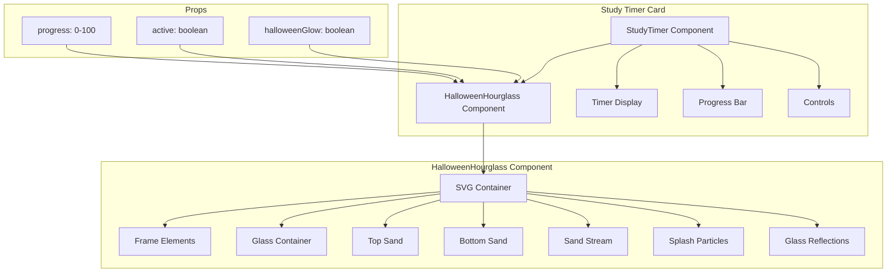

# Design Document: Halloween Hourglass Timer

## Overview

This design implements an animated SVG hourglass component that visualizes study session progress. The hourglass features sand that drains from top to bottom based on timer progress, with animated sand stream effects when active. The component integrates with the Halloween dashboard theme through orange sand colors and purple glow accents.

## Architecture



## Components and Interfaces

### HalloweenHourglass Component

```typescript
// app/(protected)/dashboard/study/_components/halloween-hourglass.tsx
interface HalloweenHourglassProps {
  progress: number;        // 0 to 100 - percentage of session completed
  active: boolean;         // Whether timer is currently running
  halloweenGlow?: boolean; // Enable Halloween theme styling
  className?: string;      // Additional CSS classes
}

export function HalloweenHourglass({
  progress,
  active,
  halloweenGlow = false,
  className,
}: HalloweenHourglassProps): JSX.Element
```

### Integration with StudyTimer

```typescript
// In study-timer.tsx
<HalloweenHourglass 
  progress={progress}      // (studyTime / studyDuration) * 100
  active={isStudying}      // Timer running state
  halloweenGlow={halloweenGlow}
/>
```

## Data Models

### SVG Geometry Constants

```typescript
const HOURGLASS_GEOMETRY = {
  viewBox: "0 0 100 150",
  glassPath: `
    M35,25 
    Q25,25 25,50 
    Q25,70 48,75 
    Q25,80 25,100 
    Q25,125 35,125 
    H65 
    Q75,125 75,100 
    Q75,80 52,75 
    Q75,70 75,50 
    Q75,25 65,25 
    Z
  `,
  topBulbClip: "M25,25 Q25,50 25,70 Q48,75 50,75 Q52,75 75,70 Q75,50 75,25 Z",
  bottomBulbClip: "M25,100 Q25,125 35,125 H65 Q75,125 75,100 Q75,80 52,75 Q50,75 48,75 Q25,80 25,100 Z",
};

const SAND_CONFIG = {
  topSandHeight: 50,      // Max height of sand in top bulb
  bottomSandHeight: 50,   // Max height of sand in bottom bulb
  baseY: {
    top: 25,              // Y position where top sand starts
    bottom: 125,          // Y position where bottom sand ends
  },
};
```

### Color Configuration

```typescript
const COLORS = {
  halloween: {
    sand: "#fb923c",           // Orange
    sandDark: "#ea580c",       // Darker orange for gradient
    glow: "rgba(147,51,234,0.3)", // Purple glow
    accent: "#9333ea",         // Purple accent
  },
  default: {
    sand: "#eab308",           // Yellow
    sandDark: "#ca8a04",       // Darker yellow
  },
  frame: {
    light: "#71717a",          // Zinc-500
    dark: "#3f3f46",           // Zinc-700
    stroke: "#27272a",         // Zinc-800
  },
  glass: {
    highlight: "rgba(255,255,255,0.3)",
    base: "rgba(255,255,255,0.1)",
  },
};
```

### Sand Level Calculations

```typescript
// Calculate sand positions based on progress
function calculateSandLevels(progress: number) {
  const topSandY = SAND_CONFIG.baseY.top + (progress / 100) * SAND_CONFIG.topSandHeight;
  const bottomSandY = SAND_CONFIG.baseY.bottom - (progress / 100) * SAND_CONFIG.bottomSandHeight;
  
  return { topSandY, bottomSandY };
}
```

## Correctness Properties

*A property is a characteristic or behavior that should hold true across all valid executions of a system-essentially, a formal statement about what the system should do. Properties serve as the bridge between human-readable specifications and machine-verifiable correctness guarantees.*

### Property 1: Sand Level Progress Mapping
*For any* progress value between 0 and 100, the top sand Y position SHALL equal baseY.top + (progress / 100) * topSandHeight, and the bottom sand Y position SHALL equal baseY.bottom - (progress / 100) * bottomSandHeight.
**Validates: Requirements 1.2**

### Property 2: Sand Stream Visibility
*For any* combination of active state and progress value, the sand stream SHALL be visible if and only if active is true AND progress is less than 99.
**Validates: Requirements 2.1, 2.2**

### Property 3: Halloween Color Selection
*For any* render with halloweenGlow set to true, the sand color SHALL be #fb923c (orange), and for halloweenGlow set to false, the sand color SHALL be #eab308 (yellow).
**Validates: Requirements 3.1**

## Error Handling

### Prop Validation

```typescript
// Clamp progress to valid range
const clampedProgress = Math.max(0, Math.min(100, progress));

// Default halloweenGlow to false if undefined
const enableGlow = halloweenGlow ?? false;
```

### SVG Rendering Safety

```typescript
// Use unique IDs for gradients and clip paths to avoid conflicts
// when multiple hourglasses render on the same page
const gradientId = useId();
```

## Testing Strategy

### Dual Testing Approach

This feature requires both unit tests and property-based tests to ensure correctness.

### Unit Tests

Unit tests will cover:
- Component renders without crashing
- SVG structure contains expected elements (glass, frame, sand)
- Glass reflections are present
- Frame has gradient styling
- Ellipse element exists for 3D sand surface effect
- Transition classes are applied to sand elements

### Property-Based Tests

Property-based tests will use **fast-check** library for TypeScript/JavaScript.

Each property-based test MUST:
1. Run a minimum of 100 iterations
2. Be tagged with the format: `**Feature: halloween-hourglass-timer, Property {number}: {property_text}**`
3. Reference the correctness property from this design document

#### Property Test Implementation

```typescript
import * as fc from 'fast-check';
import { render } from '@testing-library/react';
import { HalloweenHourglass } from './halloween-hourglass';

// **Feature: halloween-hourglass-timer, Property 1: Sand Level Progress Mapping**
test.prop([fc.integer({ min: 0, max: 100 })])('sand levels correctly map to progress', (progress) => {
  const topSandY = 25 + (progress / 100) * 50;
  const bottomSandY = 125 - (progress / 100) * 50;
  
  // Verify calculations are correct
  expect(topSandY).toBeGreaterThanOrEqual(25);
  expect(topSandY).toBeLessThanOrEqual(75);
  expect(bottomSandY).toBeGreaterThanOrEqual(75);
  expect(bottomSandY).toBeLessThanOrEqual(125);
});

// **Feature: halloween-hourglass-timer, Property 2: Sand Stream Visibility**
test.prop([
  fc.boolean(),
  fc.integer({ min: 0, max: 100 })
])('sand stream visibility based on active and progress', (active, progress) => {
  const shouldShowStream = active && progress < 99;
  const { container } = render(
    <HalloweenHourglass progress={progress} active={active} />
  );
  
  const streamElements = container.querySelectorAll('[class*="animate-sand-stream"]');
  const hasStream = streamElements.length > 0;
  
  expect(hasStream).toBe(shouldShowStream);
});

// **Feature: halloween-hourglass-timer, Property 3: Halloween Color Selection**
test.prop([fc.boolean()])('sand color based on halloweenGlow', (halloweenGlow) => {
  const expectedColor = halloweenGlow ? "#fb923c" : "#eab308";
  const { container } = render(
    <HalloweenHourglass progress={50} active={false} halloweenGlow={halloweenGlow} />
  );
  
  // Check that sand gradient uses correct color
  const sandGradient = container.querySelector('#sandGradient stop');
  expect(sandGradient?.getAttribute('stop-color')).toBe(expectedColor);
});
```

### Test File Location

Tests will be co-located with the component:
- `app/(protected)/dashboard/study/_components/halloween-hourglass.test.tsx`
