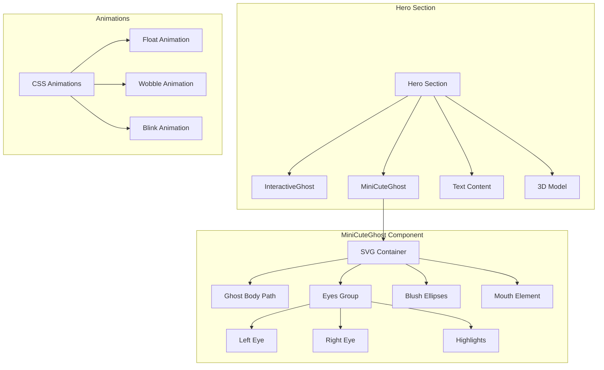

# Design Document: Mini Cute Ghost Hero

## Overview

This design implements a small, adorable animated ghost component for the hero section. The ghost features a rounded SVG body with cute facial expressions, smooth floating animation, and configurable props for positioning and timing. The component uses CSS animations for optimal performance and GPU acceleration.

## Architecture



## Components and Interfaces

### MiniCuteGhost Component

```typescript
// components/mini-cute-ghost.tsx
interface MiniCuteGhostProps {
  className?: string;      // Additional CSS classes for positioning
  size?: 'sm' | 'md' | 'lg'; // Ghost size variant
  delay?: number;          // Animation delay in seconds
}

export function MiniCuteGhost({
  className,
  size = 'md',
  delay = 0,
}: MiniCuteGhostProps): JSX.Element
```

### Integration with Hero Section

```typescript
// In app/page.tsx hero section
<MiniCuteGhost 
  className="absolute top-20 right-20 z-20" 
  size="sm"
  delay={0.5}
/>
```

## Data Models

### Size Configuration

```typescript
const SIZE_CONFIG = {
  sm: {
    width: 'w-12',
    height: 'h-12',
  },
  md: {
    width: 'w-16',
    height: 'h-16',
  },
  lg: {
    width: 'w-24',
    height: 'h-24',
  },
};
```

### SVG Geometry

```typescript
const GHOST_SVG = {
  viewBox: "0 0 100 100",
  // Rounded cute ghost body
  bodyPath: "M50 10 C25 10 10 30 10 55 C10 75 15 85 20 90 L25 85 L30 90 L35 85 L40 90 L45 85 L50 90 L55 85 L60 90 L65 85 L70 90 L75 85 L80 90 C85 85 90 75 90 55 C90 30 75 10 50 10 Z",
  // Eye positions
  leftEye: { cx: 35, cy: 45, r: 6 },
  rightEye: { cx: 65, cy: 45, r: 6 },
  // Eye highlights
  highlight: { r: 2, offset: { x: 2, y: -2 } },
  // Blush positions
  leftBlush: { cx: 25, cy: 55, rx: 6, ry: 3 },
  rightBlush: { cx: 75, cy: 55, rx: 6, ry: 3 },
  // Mouth
  mouth: { cx: 50, cy: 60, r: 4 },
};
```

### Animation Configuration

```typescript
const ANIMATION_CONFIG = {
  float: {
    duration: '3s',
    keyframes: `
      0%, 100% { transform: translateY(0) rotate(-3deg); }
      50% { transform: translateY(-12px) rotate(3deg); }
    `,
  },
  blink: {
    duration: '4s',
    keyframes: `
      0%, 96%, 100% { transform: scaleY(1); }
      98% { transform: scaleY(0.1); }
    `,
  },
};
```

## Correctness Properties

*A property is a characteristic or behavior that should hold true across all valid executions of a system-essentially, a formal statement about what the system should do. Properties serve as the bridge between human-readable specifications and machine-verifiable correctness guarantees.*

### Property 1: Prop Application
*For any* combination of className, size, and delay props, the rendered component SHALL apply the className to the container, use the correct size dimensions, and set the animation-delay style to the delay value in seconds.
**Validates: Requirements 4.1, 4.2, 4.3, 4.4**

### Property 2: Size Dimension Mapping
*For any* size prop value ('sm', 'md', 'lg'), the component SHALL render with the corresponding width and height classes from the SIZE_CONFIG.
**Validates: Requirements 4.2**

## Error Handling

### Default Props

```typescript
// Provide sensible defaults for all optional props
const {
  className = '',
  size = 'md',
  delay = 0,
} = props;
```

### Animation Delay Validation

```typescript
// Ensure delay is a valid number
const animationDelay = typeof delay === 'number' && delay >= 0 ? delay : 0;
```

## Testing Strategy

### Dual Testing Approach

This feature requires both unit tests and property-based tests to ensure correctness.

### Unit Tests

Unit tests will cover:
- Component renders without crashing
- SVG structure contains ghost body path
- Eyes with highlights are present
- Blush ellipses are present
- Mouth element is present
- Float animation class is applied
- Blink animation class is applied to eyes
- will-change CSS property is set

### Property-Based Tests

Property-based tests will use **fast-check** library for TypeScript/JavaScript.

Each property-based test MUST:
1. Run a minimum of 100 iterations
2. Be tagged with the format: `**Feature: mini-cute-ghost-hero, Property {number}: {property_text}**`
3. Reference the correctness property from this design document

#### Property Test Implementation

```typescript
import * as fc from 'fast-check';
import { render } from '@testing-library/react';
import { MiniCuteGhost } from './mini-cute-ghost';

// **Feature: mini-cute-ghost-hero, Property 1: Prop Application**
test.prop([
  fc.string(),
  fc.constantFrom('sm', 'md', 'lg'),
  fc.float({ min: 0, max: 10 })
])('props are correctly applied', (className, size, delay) => {
  const { container } = render(
    <MiniCuteGhost className={className} size={size} delay={delay} />
  );
  
  const wrapper = container.firstChild as HTMLElement;
  
  // className is applied
  if (className) {
    expect(wrapper.className).toContain(className);
  }
  
  // animation-delay is set
  expect(wrapper.style.animationDelay).toBe(`${delay}s`);
});

// **Feature: mini-cute-ghost-hero, Property 2: Size Dimension Mapping**
test.prop([fc.constantFrom('sm', 'md', 'lg')])('size maps to correct dimensions', (size) => {
  const sizeMap = {
    sm: { width: 'w-12', height: 'h-12' },
    md: { width: 'w-16', height: 'h-16' },
    lg: { width: 'w-24', height: 'h-24' },
  };
  
  const { container } = render(<MiniCuteGhost size={size} />);
  const wrapper = container.firstChild as HTMLElement;
  
  expect(wrapper.className).toContain(sizeMap[size].width);
  expect(wrapper.className).toContain(sizeMap[size].height);
});
```

### Test File Location

Tests will be co-located with the component:
- `components/mini-cute-ghost.test.tsx`
