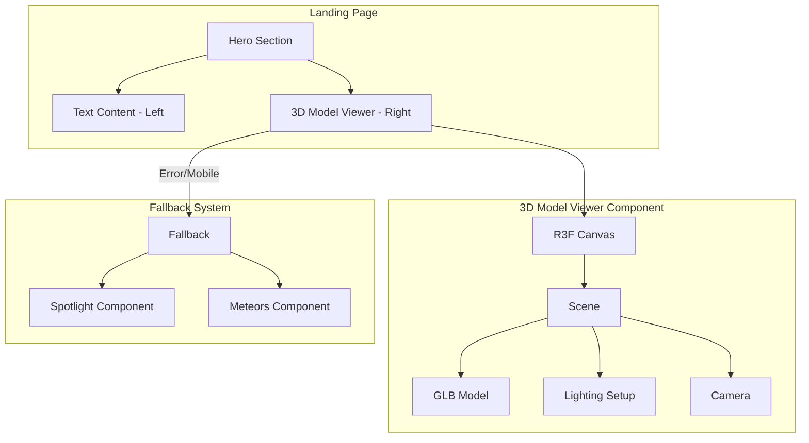

# Design Document: Three.js Hero Model

## Overview

This design replaces the Unicorn Studio hero background with a Three.js-powered 3D model viewer using React Three Fiber. The hero section will be restructured into a two-column layout on desktop: marketing text on the left and an interactive 3D skeleton with plane model on the right. The implementation prioritizes performance, graceful degradation, and maintainability.

## Architecture



## Components and Interfaces

### 1. ThreeHeroModel Component

The main component that renders the 3D model viewer.

```typescript
// components/three-hero-model.tsx
interface ThreeHeroModelProps {
  className?: string;
}

export function ThreeHeroModel({ className }: ThreeHeroModelProps): JSX.Element
```

### 2. SkeletonModel Component

Internal component that loads and renders the GLB model.

```typescript
// components/three-hero-model.tsx (internal)
interface SkeletonModelProps {
  url: string;
  scale?: number;
  position?: [number, number, number];
  rotation?: [number, number, number];
}

function SkeletonModel({ url, scale, position, rotation }: SkeletonModelProps): JSX.Element
```

### 3. SceneLighting Component

Internal component that sets up the lighting configuration.

```typescript
// components/three-hero-model.tsx (internal)
interface SceneLightingProps {
  ambientIntensity?: number;
  directionalIntensity?: number;
  directionalPosition?: [number, number, number];
}

function SceneLighting(props: SceneLightingProps): JSX.Element
```

### 4. Updated Hero Section Structure

```typescript
// app/page.tsx (hero section)
<section className="hero-section">
  <div className="grid lg:grid-cols-2">
    {/* Left: Text Content */}
    <div className="text-content">
      <h1>Study. Connect. Achieve.</h1>
      <p>Description...</p>
      <div>CTA Buttons</div>
    </div>
    
    {/* Right: 3D Model (desktop only) */}
    <div className="hidden lg:block">
      <ThreeHeroModel />
    </div>
  </div>
  
  {/* Mobile fallback */}
  <div className="lg:hidden">
    <Meteors />
  </div>
</section>
```

## Data Models

### GLB Model Asset

- **Path**: `public/skelton with plane.glb`
- **Format**: GLTF Binary (.glb)
- **Usage**: Loaded via `useGLTF` hook from @react-three/drei

### Component State

```typescript
interface ModelViewerState {
  isLoading: boolean;
  hasError: boolean;
  mounted: boolean;
}
```

## Correctness Properties

*A property is a characteristic or behavior that should hold true across all valid executions of a system-essentially, a formal statement about what the system should do. Properties serve as the bridge between human-readable specifications and machine-verifiable correctness guarantees.*

Based on the prework analysis, the following properties can be tested:

### Property 1: Scene Lighting Configuration
*For any* rendered 3D scene, the scene SHALL contain both ambient light and at least one directional light component to ensure proper model illumination.
**Validates: Requirements 2.1, 2.2**

### Property 2: SSR Safety
*For any* server-side render attempt, the ThreeHeroModel component SHALL not throw errors and SHALL render null or a placeholder without accessing browser-only APIs.
**Validates: Requirements 3.3**

### Property 3: Resource Cleanup on Unmount
*For any* component unmount event, the ThreeHeroModel component SHALL dispose of Three.js resources (geometries, materials, textures) to prevent memory leaks.
**Validates: Requirements 3.4**

### Property 4: Loading State Display
*For any* model loading state (before GLB is fully loaded), the component SHALL display a loading indicator or placeholder content.
**Validates: Requirements 5.1**

### Property 5: Error Fallback Rendering
*For any* model loading error, the component SHALL render the Spotlight fallback component instead of showing broken content.
**Validates: Requirements 5.2**

## Error Handling

### Model Loading Errors

```typescript
const handleModelError = (error: Error) => {
  console.error('Failed to load 3D model:', error);
  setHasError(true);
  // Fallback to Spotlight component
};
```

### SSR Handling

```typescript
// Use dynamic import with ssr: false
const ThreeHeroModel = dynamic(
  () => import('@/components/three-hero-model').then(mod => mod.ThreeHeroModel),
  { 
    ssr: false,
    loading: () => <ModelPlaceholder />
  }
);
```

### Resource Disposal

```typescript
useEffect(() => {
  return () => {
    // Cleanup Three.js resources
    scene.traverse((object) => {
      if (object instanceof THREE.Mesh) {
        object.geometry.dispose();
        if (Array.isArray(object.material)) {
          object.material.forEach(m => m.dispose());
        } else {
          object.material.dispose();
        }
      }
    });
  };
}, []);
```

## Testing Strategy

### Dual Testing Approach

This feature requires both unit tests and property-based tests to ensure correctness.

### Unit Tests

Unit tests will cover:
- Component renders without crashing
- Loading state is displayed initially
- Error state triggers fallback rendering
- Mobile breakpoint hides 3D model
- Text content renders correctly

### Property-Based Tests

Property-based tests will use **fast-check** library for TypeScript/JavaScript.

Each property-based test MUST:
1. Run a minimum of 100 iterations
2. Be tagged with the format: `**Feature: threejs-hero-model, Property {number}: {property_text}**`
3. Reference the correctness property from this design document

#### Property Test Examples

```typescript
// **Feature: threejs-hero-model, Property 1: Scene Lighting Configuration**
test.prop([fc.boolean()])('scene always contains required lights', (mounted) => {
  // For any mounted state, verify lighting components exist
});

// **Feature: threejs-hero-model, Property 5: Error Fallback Rendering**
test.prop([fc.constant(new Error('Load failed'))])('errors trigger fallback', (error) => {
  // For any error, verify Spotlight fallback renders
});
```

### Test File Location

Tests will be co-located with the component:
- `components/three-hero-model.test.tsx` - Unit and property tests
